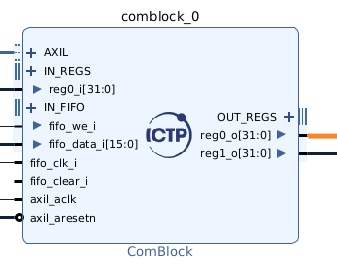

# ADC500 UDMA Simple

## Estructura de Git para el proyecto

Se busca que dentro del git se separe de una forma ordenada los elementos a utilizar por lo general, que dentro de el git existan todos los elementos necesarios para reconstruir el proyecto en otro entorno. La estructura de las carpetas dentro del proyecto puede ser la siguiente:

- Proyecto
    - bd: se almacena el o los block design del proyecto
    - constraint: el o el grupo de constraint files necesarios
    - ip: ip cores utilizados para poder reconstruir el proyecto
    - src: sources todo los elementos de software que forman parte del proyecto
    - vhdl: todos los bloques de vhdl utilizados

Se recomienda una carpeta **documentation o doc** para toda la documentación que forme parte del proyecto incluyendo imágenes.

El readme file es una parte importante del proyecto toda la información necesaria para reproducir el proyecto como comandos específicos, librerías, versiones de software y demás, se debe de explicar paso a paso dentro del readme sin ser muy extenso, en caso se vea la necesidad de extender esta explicación se puede hacer referencia a un documento que se encuentre dentro de la carpeta doc.

El gitignore tendrá todos los elementos que no quieren en la nube por lo general, no compartir el proyecto generado por vivado ni el workspace de vitis, pero si se puede compartir el tcl que regenera el proyecto.

Si existen dudas al respecto de git y como utilizarlo se puede consultar [este libro.](https://git-scm.com/book/en/v2)

Tratar de estandarizar los mensajes de los commits en git para establecer un log fácil de entender y depurar. [conventional commits](https://www.conventionalcommits.org/en/v1.0.0/)

## Para clonar este proyecto

El proyecto cuenta con todo lo necesario para poder recrearlo, utiliza varios elementos como sub módulos en git por tal razón para clonarlo 

```
git clone https://github.com/Mballina42/ADC500-UDMA.git --recursive
```

### En caso los submodulos no carguen

#### **Submodulo ADC500** 

Primero se debe de agregar el git del driver del ADC500 por medio de submodulos, dentro de la carpeta vhdl:

```
$ git submodule add https://gitlab.com/ictp-mlab/adc500.git
```

#### **Submodulo ComeBlock**

Agregar el git del ip core del comeblock por medio de submodulos, dentro de la carpeta ip:

```
$ git submodule add https://gitlab.com/rodrigomelo9/core-comblock.git
```

## Autobuild

### From linux Terminal
Setup Vivado enviroment.

```
$ source <path_to_vivado>/Vivado/2022.1/settings64.sh
$ vivado -s adc500_udma_prj.tcl
```

### From Vivado Terminal

From Tcl Console change directory to <this_git> and run:

```
cd <this_git>
source adc500_udma_prj.tcl
```

### From Sources

- Create a new vivado project for Zedboard
- Add ip_repo repository to the IP location.
- From "Add sources/Add or create design sources" menu, add  vhdl/adc500 directory to the sources
- From "Add sources/Add or create design sources" menu, add  vhdl/Decimator directory to the sources
- From "Add sources/Add or create constraints" menu, add "constraint/ADC500.xdc" and "constraint/GPIO.xdc" directory
- At the IP repository ad the Comblock directory
- Change directory to the git repository in the TCL folder

```
cd <this_git>
```

- Generate the block diagram by running the following command:

```
cd bd/
source ./Top.tcl
```

- Create wrapper and set it as top.
- Generate bitstream.

## Distribución de pines del comblock



### Output registers

- reg0: adc500 controller, Control registers in
- reg1: decimator, N

### Input registers

- reg0 adc500 controller, Control registers out

## UDMA

Tener el udma instalado

- Crear un application proyecto con la plantilla de udma
- Verificar la ip de tu red local en caso tener iguales los primeros 3 octetos, cambiar la red de ejemplo en la plantilla de UDMA, la ip que se le da a la tarjeta debe de asignarse una conexión punto a punto a la computadora a interactuar.
